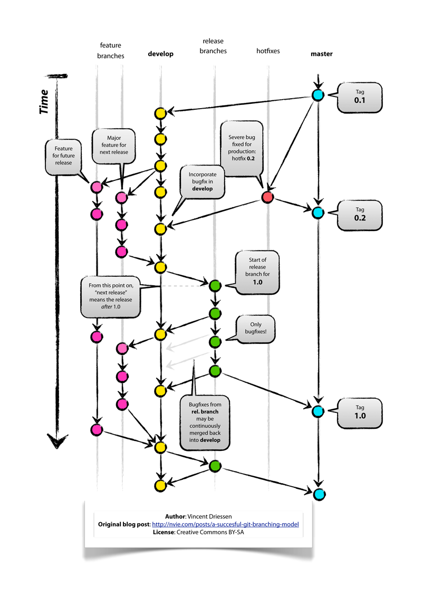

Beginning March 15, 2013 we will be integrating automated deployment into the portal customization workflow. The following is a guide to help you deploy your code automagically by pushing your commits back to the github repo.

1. A github repo will be created for you by ops when the portal is created. It will be forked from a template. Any repo not forked from this template most likely will have issues with deployment. Please don't change the root directory structure of the repo. It will most likely include several folders (and maybe a few more):

  * modules folder

  * libraries folder

  * themes folder

1. Clone the repo locally and create a *devl* branch. 

1. Primary development should take place in the *devl* branch. if you have features that should not be deployed until development has completed please create a branch for each feature, then merge the features back into the *devl* branch. 

[link](http://nvie.com/posts/a-successful-git-branching-model/) to original article.

1. When development is complete and the code is bug-free locally, please merge the *devl* branch into the *test* branch. 

  1. check out the code to the *devl* branch.

  1. checkout the *test* branch. 

  1. Merge the *devl* branch into the current branch (*test*).

  1. If there are merge conflicts, please resolve them. 

  1. push the test branch to origin (push origin devl).

  1. If the test branch does not exist, create it from the current *devl* branch by typing 'git branch test' then 'push origin test'. 

1. Once github has the commit, Puppet will poll the repo's test branch and then deploy the new commit to a "holding space" while it runs code checks checking for lack of syntax errors, coding formatting, and what's called a "mess detector" to check for infinite loops, etc. Once these code checks are complete, puppet will push the code out to all the servers that run your instance of the portal.

1. Follow the same process with production for the production branch, with one exception. Once the commit has been pushed to the *prod* branch, you will need the github SHA of your commit. A form will be provided for you to request a push of that code to production. Ops will be one last stop to keep unwanted and/or untested code from getting into production. Understand that pushing to the branch is a commit to moving the code to production. You have the ability to take down your site. You want to make sure your code is thoroughly tested before merging it into the production branch. 

